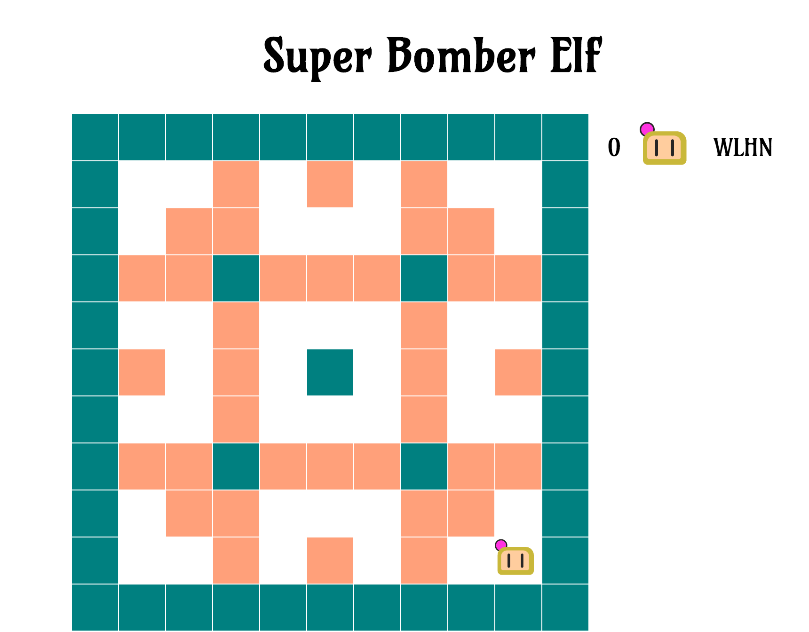

# Super Bomber Elf

A Super Bomberman clone. Written for [West London Hack Night](http://www.meetup.com/West-London-Hack-Night/).



## Building & Running

### Running directly

You'll need [stack](https://github.com/commercialhaskell/stack) and [Elm](http://elm-lang.org/).

(Note: If this is the first time you've run `stack`, it might take a
while to fetch & build the dependencies. Have coffee ready.)

#### Frontend

``` sh
cd client
stack runhaskell Shake.hs
```

#### Backend

Copy `server/bomberman.sample.yaml` to `~/.bomberman.yaml` and edit appropriately. Then:

``` sh
cd server
stack build
stack exec bomberman
```

#### Testing

``` sh
cd server
stack test
```

### Running using Docker

#### Frontend and backend

To build the frontend and backend, then start up the server:

1. Install [Docker](https://docs.docker.com/get-docker/) and [Docker Compose](https://docs.docker.com/compose/install/)
2. Run `docker-compose up`.
3. Open http://localhost:8080/view in your browser

#### Testing
While the server is running:
```sh
docker exec -it super-bomber-elf-server bash
cd server
stack test
```